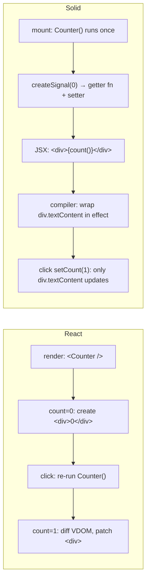

# SolidJS vs React Playbook

What a React developer needs to know to read and modify the CDC frontend. Every claim is backed by the actual code in `frontend/src/`.

---

## Mental Model: Components Run Once

This is the single insight that makes Solid predictable. Here is the same counter in both frameworks:

**React:** The function component re-runs top-to-bottom on every `count` change. Every line executes again; `useState` returns the latest value.

**Solid:** The component function runs **exactly once** on mount. After that, only the raw DOM nodes whose text or attributes depend on a signal are patched in-place.



In the CDC codebase, this means:

- `RoomView.tsx` runs once when you navigate to `/room/:code`. The `switch (room.state)` inside it never re-runs — instead, the `<Show>` and `<For>` components inside each child view subscribe to signals and update only the DOM they own.
- All view components receive `props.state` (a Solid store) and `props.send`. Neither the component function nor the props object re-executes — only specific signal reads inside JSX trigger DOM patches.

---

## Signal Primitives — React to Solid Translation Table

| Concept | React | Solid | Gotcha |
|---|---|---|---|
| State holder | `const [count, setCount] = useState(0)` | `const [count, setCount] = createSignal(0)` | In Solid, `count` is a **getter function**. In JSX, write `{count()}` not `{count}`. `{count}` renders the function source, not the value. |
| Side effect | `useEffect(fn, [deps])` | `createEffect(fn)` | Solid effects have **no dependency array**. They re-run whenever any signal read inside `fn` changes. Use `untrack(() => …)` to read a signal without subscribing. |
| Memoized derived | `useMemo(fn, [deps])` | `createMemo(fn)` | Memos in Solid are reactive — reading a memo subscribes to it. See `LobbyView.tsx:16-17`: `createMemo(() => room().raceGapDeckMs / 1000)` for the pacing display. |
| Object store | `useReducer` / `useState({…})` with spread | `createStore({…})` from `solid-js/store` | **Critical:** Solid signals track identity (replace the whole object to trigger). Stores track **property-level** changes (`setState('field', newVal)` or `setState((prev) => ({...prev, field: newVal}))`). CDC uses `createStore<RoomState>` in `store.ts:18`. |
| Ref (DOM node) | `useRef<HTMLDivElement>(null)` → `ref.current` | `let divRef!: HTMLDivElement` + `ref={divRef}` | No `.current` wrapper — it's just a variable. But refs are not signals: assigning to one does not trigger re-renders. |
| Context | `useContext(MyContext)` | `createContext` + `useContext` | Same API, same caveat: context changes re-run the whole consuming component in React but only the signal-dependent DOM in Solid. |

---

## Common Gotchas

### Destructuring Props Breaks Reactivity

```tsx
// ❌ WRONG — props.name is read once at mount, never updated
function PlayerBadge({ name, isConnected }: { name: string; isConnected: boolean }) {
  return <span>{name}{isConnected ? " ●" : " ○"}</span>;
}

// ✅ RIGHT — props is a Proxy, each access is tracked
function PlayerBadge(props: { name: string; isConnected: boolean }) {
  return <span>{props.name}{props.isConnected ? " ●" : " ○"}</span>;
}
```

**In our codebase:** Every view component uses `props.state.room!` and `props.send` rather than destructuring. `LobbyView.tsx` uses `const room = () => props.state.room!` as a derived getter, not a destructured value.

### Spreading Props Breaks Reactivity

```tsx
// ❌ WRONG — spread reads all props eagerly, losing the Proxy
function Card(props: { title: string; body: string }) {
  const merged = { ...props, footer: "default" };
  return <div>{merged.title}</div>;
}

// ✅ RIGHT — use mergeProps from solid-js
import { mergeProps } from "solid-js";
function Card(props: { title: string; body: string }) {
  const merged = mergeProps({ footer: "default" }, props);
  return <div>{merged.title}</div>;
}
```

### Conditional Rendering: Use `<Show>`, Not `{cond && <X />}`

```tsx
// ❌ WRONG — <X /> is created eagerly; the `false` branch still allocates
{room().isLocked && <LockIcon />}

// ✅ RIGHT — <X /> is created only when the condition is true
import { Show } from "solid-js";
<Show when={room().isLocked}><LockIcon /></Show>
```

**In our codebase:** `<Show>` is used everywhere. Search `frontend/src/views/*.tsx` — every conditional render uses `<Show when={…}>`.

### Lists: Use `<For>`, Not `.map()`

```tsx
// ❌ WRONG — re-creates every row on every signal change
{players().map((p) => <PlayerRow player={p} />)}

// ✅ RIGHT — keys by identity, only patches changed rows
import { For } from "solid-js";
<For each={room().players}>{(p) => <PlayerRow player={p} />}</For>
```

**In our codebase:** `<For>` is used for player lists, race log entries, drink targets, and every iterable UI. `.map()` should never appear in JSX.

### createEffect Runs at Creation

```tsx
// ❌ WRONG — setTimeout reads count(), but the effect body ran already
createEffect(() => {
  setTimeout(() => {
    console.log(count()); // reads the value at effect-creation time
  }, 1000);
});

// ✅ RIGHT — use a signal to drive the timer's effect
createEffect(() => {
  const current = count();
  const timer = setTimeout(() => console.log(current), 1000);
  onCleanup(() => clearTimeout(timer));
});
```

The key insight: `createEffect` sets up a tracking scope. Only synchronous reads inside the function body are tracked. Async callbacks (setTimeout, fetch.then) are new microtasks — Solid cannot track reads that happen after `await`.

---

## Our Frontend Architecture

### App Entry

`frontend/src/main.tsx:7`:
```tsx
render(() => <App />, root);
```

`frontend/src/App.tsx:5-12`:
```tsx
import { Router, Route } from "@solidjs/router";
import HomeView from "./views/HomeView";
import RoomView from "./views/RoomView";

export default function App() {
  return (
    <Router>
      <Route path="/" component={HomeView} />
      <Route path="/room/:code" component={RoomView} />
    </Router>
  );
}
```

The router is `@solidjs/router`. It handles SPA navigation without page reloads — `useParams()` extracts the `:code` segment, `useSearchParams()` reads query params (`?name=…`).

### Connection Layer

`frontend/src/ws/store.ts:17-87` exports `createRoomConnection(code, name)`:

```ts
export function createRoomConnection(roomCode: string, playerName: string) {
  const [state, setState] = createStore<RoomState>({ … });

  // Opens a WebSocket, sends join_room on open, applies every server message
  // via setState((prev) => applyServerMessage(prev, parsed)).

  // Exponential-backoff reconnect: 500ms * 2^retry, max 5s, up to 10 retries.

  return { state, send, disconnect };
}
```

Every view receives `state` (the `RoomState` store) and `send` (a `(msg: ClientMessage) => void` function). The store mutates only via `setState` — there is no direct mutation.

`frontend/src/ws/handle.ts:38-202` defines `applyServerMessage(state, msg): RoomState` — a pure reducer. It does not mutate; it returns a new state object. The `setState` producer calls it inside the store's update function.

### View Components

`RoomView.tsx` is a phase-router. It reads `room.state` and picks the correct view via a `switch`. Each view is a separate file, one per phase:

| File | Phase | What It Renders |
|---|---|---|
| `HomeView.tsx` | (no room) | Room code input + player name form |
| `LobbyView.tsx` | LOBBY | Host controls, player list, room settings |
| `BiddingView.tsx` | BIDDING | Suit buttons + bid amount + confirmation |
| `CountdownView.tsx` | COUNTDOWN | 4-second countdown display |
| `RacingView.tsx` | RACING | Horse grid + track cards + race log stream |
| `ResultsView.tsx` | SETTLEMENT | Placements + settlement breakdown |
| `DistributionView.tsx` | DISTRIBUTION | Drink assignment UI + timer |
| `DoneView.tsx` | READY | Ready button + drink tally |

### Style System

Single `frontend/src/styles/global.css`. No CSS modules, no Tailwind, no CSS-in-JS. Key classes:

- `.card` — the standard panel (dark background, rounded, border)
- `.phase-badge` — the purple phase indicator chip
- `.player-list` — unstyled list with dividers
- `.horse-grid` / `.horse-cell` / `.horse-knight` — the race track grid layout
- `.suit-btns` / `.amount-btns` — bid selection button groups
- `.race-log` — scrollable monospace event log
- `.race-turn` — animated event entries with `.race-turn--enter` slide-in animation

New components should reuse these classes; new class names should follow the same kebab-case convention.

---

## How to Migrate a React Component

A concrete side-by-side. **React:**

```tsx
function Counter() {
  const [count, setCount] = useState(0);
  const [label, setLabel] = useState("Clicks");

  useEffect(() => {
    document.title = `${label}: ${count}`;
  }, [count, label]);

  return (
    <div>
      <h2>{label}</h2>
      <button onClick={() => setCount(count + 1)}>{count}</button>
    </div>
  );
}
```

**Solid — same behavior:**

```tsx
import { createSignal, createEffect } from "solid-js";

function Counter() {
  const [count, setCount] = createSignal(0);
  const [label, setLabel] = createSignal("Clicks");

  createEffect(() => {
    document.title = `${label()}: ${count()}`;
  });

  return (
    <div>
      <h2>{label()}</h2>
      <button onClick={() => setCount(count() + 1)}>{count()}</button>
    </div>
  );
}
```

**What changed:**
1. `useState(0)` → `createSignal(0)`. The getter is a function: `count` → `count()`.
2. `useEffect(fn, [count, label])` → `createEffect(fn)`. No dependency array — Solid tracks which signals `fn` reads.
3. In JSX, `{count}` → `{count()}`. Forgetting the `()` is the #1 bug for React transplants.
4. The component function runs once. `setCount` patches only the button's text node; `setLabel` patches only the `<h2>`'s text. Nothing else in the DOM is touched.
