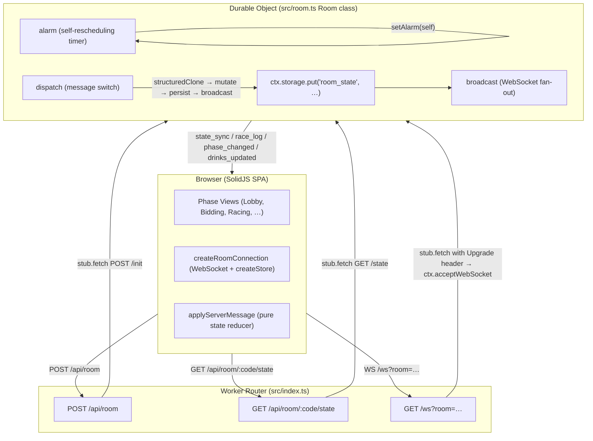
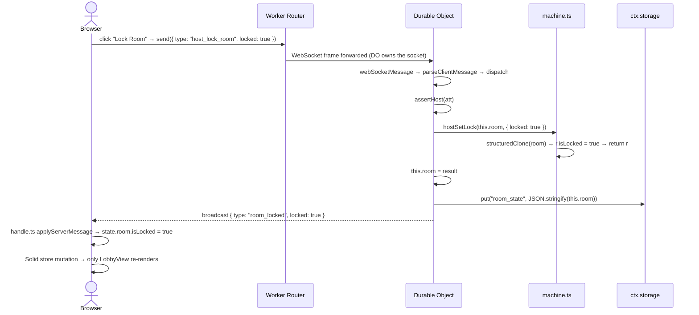

# System Architecture

Tracing a player action from browser click to game state change and back — the authoritative map of every runtime component in CDC.

---

## High-Level Topology

Three runtime tiers, no database:



- The Worker (`src/index.ts`) holds **no game state**. It is a thin HTTP router that creates/stubs/forwards to Durable Objects.
- The Durable Object (`src/room.ts Room`) owns **all game state** in-memory. There is no external database.
- The Browser is a SolidJS SPA (Vite + `@solidjs/router`). It connects via WebSocket and renders views from a reactive `createStore<RoomState>`.

---

## The Worker Router (`src/index.ts`)

The Worker is a stateless `export default { fetch }` handler deployed to Cloudflare Workers. Every request is routed to one of three handlers.

### `POST /api/room` — Room Creation

1. Generate a 4-character room code from a 30-character alphabet (no 0/O/1/I).
2. `idFromName(code)` deterministically maps the code to a DO instance.
3. `stub.fetch("https://internal/init", { method: "POST" })` calls the DO's `/init` handler.
4. If the DO returns 200 (first init), the code is unique — return it to the client.
5. If the DO returns 409 (collision — room already exists), generate a new code and retry.
6. **`MAX_COLLISION_RETRIES = 8`**; if all 8 attempts collide, return 503.

The Worker never stores the mapping; `idFromName` is a deterministic hash — the same code always resolves to the same DO.

### `GET /api/room/:code/state` — Read-Only State Check

1. Extract the room code from the URL path.
2. `stub.fetch("https://internal/state", { method: "GET" })` calls the DO's `/state` handler.
3. If the DO returns 404, the room doesn't exist — return 404 to the client.
4. Otherwise, pass the JSON body through.

Used by the frontend to verify a room code before navigating to the room page.

### `GET /ws?room=CODE` — WebSocket Upgrade

1. Extract the room code from the query string.
2. Forward the raw request to the DO via `stub.fetch`, adding an `x-room-code` header.
3. The DO calls `ctx.acceptWebSocket(server)` to take ownership of the socket.
4. The Worker returns the DO's `101 Switching Protocols` response verbatim.

This is Cloudflare's WebSocket Hibernation pattern: the Worker hands the raw TCP connection to the DO, which manages it for its lifetime. The Worker never sees WebSocket frames.

---

## The Durable Object (`src/room.ts`)

The `Room` class extends `DurableObject<Env>`. One instance per room code; Cloudflare's runtime guarantees **single-threaded** access to a given DO instance — no race conditions, no locking.

### State Model

`this.room` is an in-memory `Room` object (defined in `src/game/types.ts`). It is the **single source of truth** for a game. There is no separate database:

```
ctx.storage.put("room_state", JSON.stringify(this.room))
```

is the only persistence call. It only matters when the DO is evicted from memory (idle >30s).

### Eviction & Restore

On cold start (creation or post-eviction), the constructor runs `ctx.blockConcurrencyWhile`:

```ts
const stored = await ctx.storage.get<string>("room_state");
if (stored) {
  this.room = JSON.parse(stored) as Room;
}
```

After restore, the hot path is purely in-memory — all reads and writes operate on `this.room` directly. `persist()` serializes to JSON and calls `ctx.storage.put`.

### State Purity Contract

Every method in `src/game/machine.ts` takes a `Room` and returns a **new** `Room` via `structuredClone`. The DO's `dispatch` follows this pattern for every mutation:

```ts
this.room = machineFn(this.room, params);
await this.persist();
```

**Never mutate `this.room` directly.** Always go through a machine function, which produces a fresh clone. This invariant makes the machine testable in isolation (no DO, no storage, no WebSockets) and ensures accidental in-place mutation never leaks across the DO boundary.

### Why Durable Objects?

Typical serverless APIs are stateless; WebSockets need sticky connections, and game state is mutable from many concurrent players. A DO gives us:

| Concern | Stateless + DB | Durable Object |
|---|---|---|
| WebSocket ownership | Sticky session + pub/sub | DO owns the socket natively |
| State consistency | External DB + coordination layer (Redis) | Single-threaded, all reads/writes are local |
| Latency | DB round-trip per write | In-memory, serialized only on eviction |
| Cost model | Always-on DB + compute | Billed only when running; free idle-cost hibernation |
| Cold start | DB connection + cache warming | `storage.get` + `JSON.parse` (~1ms) |

---

## The Two-Stage Race Alarm

Race pacing is **not** a synchronous loop. The DO's `alarm()` self-reschedules in a two-stage cycle:

1. **DRAW stage:** `runDrawStep` pops a card from the deck, advances the matching horse, checks for finishes. If the 3rd horse hasn't finished, schedules the FLIP stage at `now + raceGapDeckMs` (default 2000ms) and sets `this.pendingStage = "FLIP"`.
2. **FLIP stage:** `runFlipStep` checks whether the last-placed horse advanced to an unflipped track card; if so, flips it and applies regression. Schedules the next DRAW at `now + raceGapTrackMs` (default 1000ms) and sets `this.pendingStage = null`.

```mermaid
sequenceDiagram
    participant Alarm as alarm()
    participant Draw as runDrawStep
    participant Flip as runFlipStep
    participant Settle as settleRound

    Alarm->>Draw: pendingStage != "FLIP"
    Draw-->>Alarm: state still RACING → setAlarm(now + gapDeckMs)
    Note over Alarm: pendingStage = "FLIP"
    Alarm->>Alarm: fires after gapDeckMs
    Alarm->>Flip: pendingStage == "FLIP"
    Flip-->>Alarm: state still RACING → setAlarm(now + gapTrackMs)
    Note over Alarm: pendingStage = null
    Alarm->>Alarm: fires after gapTrackMs
    Alarm->>Draw: cycle repeats…
    Note over Alarm: 3rd horse finishes during draw or flip:
    Draw-->>Alarm: state → SETTLEMENT
    Alarm->>Settle: settleRound + broadcast race_ended
    Note over Alarm: pendingStage = null; no more alarms
```

The `pendingStage` field is **private to the DO** (not on the `Room` type). If the DO is evicted between DRAW and FLIP, the cold-start constructor leaves `pendingStage` at `null`, so the next alarm restarts at DRAW — the default `null` is the correct recovery state.

Default gaps:
- `raceGapDeckMs = 2000` (time between draw card and flip reveal)
- `raceGapTrackMs = 1000` (time between flip and next draw)

Both are per-room settings (stored on `Room`), configurable by the host via `host_set_race_pacing`.

### Alarm-Driven Phase Timeouts

The alarm also handles deadline-driven phase transitions:

| Phase | Deadline Field | On Fire | Next |
|---|---|---|---|
| BIDDING | `bidDeadlineMs` (30s) | `closeBidding` → COUNTDOWN | `countdownMs` (4s) |
| COUNTDOWN | `countdownMs` (4s) | `startRace` → RACING | `now + raceGapDeckMs` |
| RACING | (self-scheduling) | Two-stage cycle (see above) | — |
| DISTRIBUTION | `distDeadlineMs` (configurable, default 30s) | `finalizeDistribution` → READY | `readyDeadlineMs` (60s) |
| READY | `readyDeadlineMs` (60s) | Auto-ready remaining, `finishRound` → LOBBY | Delete alarm |

The host can manually advance at any time via `host_advance_phase`, which sets the next deadline and replaces the alarm.

---

## The Data Flow Loop

The canonical round-trip for every gameplay action. Here is the "host locks room" example:



**The pattern to memorize:**

```
Client action
  → WS message (or HTTP for one-shots)
  → DO dispatch
  → machine.ts pure transition (structuredClone → mutate clone → return)
  → this.room = result
  → await persist()
  → broadcast (ServerMessage to all WebSockets)
  → client applyServerMessage (pure state reducer)
  → Solid createStore mutation
  → fine-grained DOM update (only the signal-dependent text/nodes re-render)
```

HTTP endpoints (`POST /api/room`, `GET /api/room/:code/state`) skip the WebSocket and broadcast steps — they are request/response only.

---

## Message Reference

### ClientMessage Types

| Type | Payload Fields | Dispatched By | Requires |
|---|---|---|---|
| `join_room` | `roomCode`, `playerName` | Any (first message on connect) | — |
| `host_lock_room` | `locked: boolean` | Host | Host |
| `host_kick_player` | `playerId: string` | Host | Host |
| `host_add_hosted_player` | `playerName: string` | Host | Host |
| `host_start_race` | — | Host | Host |
| `place_bid` | `suit: Suit`, `amount: number` | Independent player | Player |
| `host_place_bid` | `playerId`, `suit`, `amount` | Host (on behalf of hosted player) | Host |
| `host_advance_phase` | — | Host | Host |
| `host_set_track_length` | `length: number` | Host | Host |
| `host_set_race_pacing` | `gapDeckMs`, `gapTrackMs` | Host | Host |
| `host_set_distribution_time_limit` | `timeLimitMs: number` | Host | Host |
| `host_set_player_name` | `playerId`, `name` | Host | Host |
| `change_name` | `name: string` | Independent player | Player |
| `host_set_bid` | `playerId`, `suit`, `amount` | Host (legacy, use `host_place_bid`) | Host |
| `assign_drink` | `to: string`, `amount: number` | Independent player | Player |
| `clear_drink` | `fromPlayerId`, `toPlayerId`, `amount` | Independent player | Player |
| `host_assign_drink` | `fromPlayerId`, `toPlayerId`, `amount` | Host | Host |
| `host_clear_drink` | `fromPlayerId`, `toPlayerId`, `amount` | Host | Host |
| `distribution_done` | — | Player | Player |
| `ready` | `ready: boolean` | Player | Player |
| `host_set_ready` | `playerId`, `ready` | Host | Host |
| `host_end_game` | — | Host | Host |

### ServerMessage Types

| Type | Payload Fields | Sent By |
|---|---|---|
| `room_created` | `roomCode`, `playerId`, `room` | Worker (POST /api/room response) |
| `room_joined` | `playerId`, `room` | DO (on successful join_room) |
| `player_joined` | `player` | DO (broadcast to others) |
| `player_left` | `playerId` | DO (on disconnect or kick) |
| `room_locked` | `locked: boolean` | DO |
| `phase_changed` | `phase: Phase` | DO (on every phase transition) |
| `bids_updated` | `bids: Bid[]` | DO (after any bid placement) |
| `race_log` | `events: RaceLogEvent[]` | DO (incremental race events) |
| `race_ended` | `placements`, `settlement` | DO (when 3rd horse finishes) |
| `drinks_updated` | `drinks: Array<{playerId, give, take, consume, gaveAll}>` | DO (after any drink change) |
| `player_ready` | `playerId`, `ready` | DO |
| `game_ended` | — | DO (endGame: back to home) |
| `error` | `code: string`, `message: string` | DO or Worker |
| `state_sync` | `room: Room` | DO (full state snapshot) |

---

## Race Log Event Reference

The race log is the public, append-only event stream all clients see. It is the canonical audit trail of every race.

| Event Type | Fields | Emitted When |
|---|---|---|
| `DECK_DRAW` | `card: Card`, `suit: Suit`, `ignored: boolean` | A card is drawn from the deck |
| `HORSE_MOVE` | `suit: Suit`, `from: number`, `to: number`, `reason: "DECK" \| "REGRESSION"` | A horse advances or regresses |
| `TRACK_FLIP` | `index: number`, `suit: Suit`, `ignored: boolean` | A track card is flipped; suit causes regression |
| `HORSE_FINISH` | `suit: Suit`, `placement: number` | A horse crosses the finish line (1st/2nd/3rd) |
| `RACE_END` | `placements: Array<{suit, placement}>` | Third horse finishes; race over |
| `SETTLEMENT` | `playerId`, `drinksGive`, `drinksTake` | Per-bidder payout computed |
| `DRINK_GIVE` | `from: string`, `to: string`, `amount: number` | Manual drink assignment by a player |
| `DRINK_CLEAR` | `from: string`, `to: string`, `amount: number` | Manual drink assignment undone |
| `DRINK_AUTO` | `to: string`, `amount: number` | Auto-distribution of unassigned drinks |
| `PLAYER_READY` | `playerId: string` | Player marks ready |
| `DISTRIBUTION_DONE` | `playerId: string` | Player toggles distribution done |

---

## File Map

Every file in the critical directories, one-line responsibility each.

### `src/` — Game Engine & Worker

| File | Responsibility |
|---|---|
| `src/index.ts` | Worker HTTP router; POST /api/room, GET /api/room/:code/state, GET /ws; no game state |
| `src/room.ts` | Durable Object per room; owns in-memory Room state, WebSocket fan-out, alarm-driven race loop |
| `src/game/types.ts` | Domain types: Suit, Player, Bid, Horse, Card, TrackCard, DeckState, Room, Phase, RaceLogEvent |
| `src/game/machine.ts` | Pure state-machine transitions; each fn takes a Room, returns a cloned Room; no I/O |
| `src/game/race.ts` | Race primitives: applyDrawStep, applyFlipStep, placements, lastPlacedHorse |
| `src/game/settlement.ts` | Payout table: bids + placements → SettlementResult[] (V1 2/1/-1/-2 multiplier) |
| `src/game/setup.ts` | Build track cards and initial shuffled deck |
| `src/game/random.ts` | RNG abstraction (MathRNG for prod, SeededRNG for tests) + 44-card deck factory |
| `src/ws/messages.ts` | Re-export of shared/messages.ts (one-liner) |

### `shared/` — Cross-Cutting Types

| File | Responsibility |
|---|---|
| `shared/messages.ts` | Canonical Suit/Player/Bid/Horse/Room types, ClientMessage/ServerMessage unions, input validators, parseClientMessage |

### `tests/` — Test Suite

| File | Responsibility |
|---|---|
| `tests/machine.test.ts` | Unit tests for every exported machine.ts function |
| `tests/race.test.ts` | Unit tests for race primitives (draw, flip, placements) |
| `tests/messages.test.ts` | Parser tests for ClientMessage validation |
| `tests/random.test.ts` | RNG determinism and shuffle tests |
| `tests/settlement.test.ts` | Payout table correctness tests |
| `tests/setup.test.ts` | Track/deck construction tests |
| `tests/integration.test.ts` | Full round integration (lobby → bidding → race → settlement → distribution → ready) |

### `frontend/src/` — SolidJS SPA

| File | Responsibility |
|---|---|
| `frontend/src/main.tsx` | Entry point: `render(() => <App />, root)` |
| `frontend/src/App.tsx` | Router with two routes: `/` → HomeView, `/room/:code` → RoomView |
| `frontend/src/ws/store.ts` | `createRoomConnection`: WebSocket lifecycle, createStore<RoomState>, exponential-backoff reconnect |
| `frontend/src/ws/handle.ts` | `applyServerMessage`: pure reducer mapping ServerMessage → RoomState, `parseServerMessage` type guard |
| `frontend/src/views/HomeView.tsx` | Landing page: room code input + player name form |
| `frontend/src/views/RoomView.tsx` | Phase router: reads `room.state`, switches to the correct view component |
| `frontend/src/views/LobbyView.tsx` | Host controls: track length, pacing, distribution time limit, player management, lock, start |
| `frontend/src/views/BiddingView.tsx` | Suit + bid amount selection, bid confirmation |
| `frontend/src/views/CountdownView.tsx` | 4s countdown display between bidding close and race start |
| `frontend/src/views/RacingView.tsx` | Live horse grid + face-down track cards + race log stream |
| `frontend/src/views/ResultsView.tsx` | Post-race placements + settlement breakdown |
| `frontend/src/views/DistributionView.tsx` | Drink assignment UI with timer |
| `frontend/src/views/DoneView.tsx` | Ready button + drink-to-consume display |
| `frontend/src/styles/global.css` | Single global stylesheet; no CSS modules, no Tailwind |
