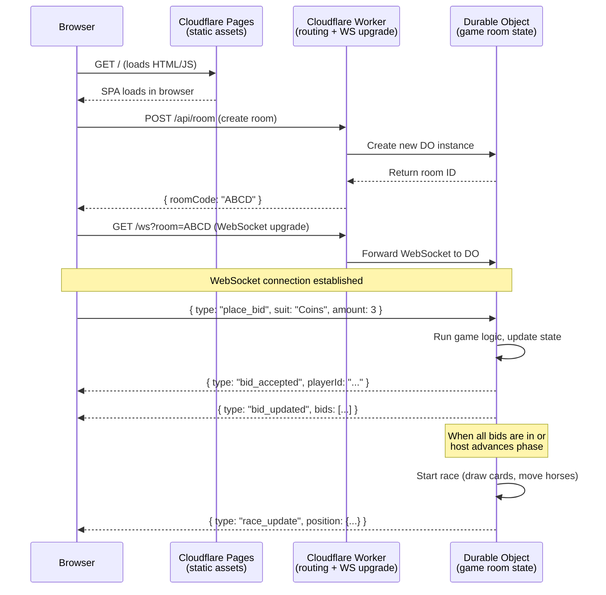

# Architecture & Stack

## Overview

We're building a browser-based multiplayer drinking game. Players open a website, create or join a **room** (identified by a short code or QR scan), play through a 9-phase horse-race betting round, and the whole thing is fully ephemeral — no accounts, no database, nothing persists after the last player leaves.

The technical challenge: **multiple browsers need to see and react to the same game state in real time.** When one player submits a bid, everyone else needs to see it. When the deck draws a card during the race, every screen must update. This is what determines the stack.

---

## Stack at a Glance

| Piece | What it does | Analogy |
|---|---|---|
| **Cloudflare Pages** | Serves the static website (HTML, CSS, JS) to the browser | The restaurant's storefront — customers walk in and see the menu |
| **Cloudflare Workers** | Handles HTTPS requests and WebSocket connections at the "edge" (servers close to the user) | The front-of-house staff who greet customers, hand out menus, and point them to the right table |
| **Durable Objects** | Holds the authoritative state for a single game room & runs the game logic | A private dining room with a dedicated server who remembers everyone's order, runs the game, and tells each guest what's happening |

All three are Cloudflare products. They live on Cloudflare's global network — servers in hundreds of cities worldwide — so a player in Tokyo connects to a server in Tokyo, not a server in Virginia.

### Why these three together

- **Pages** = static files. Zero server logic, zero cost, globally distributed.
- **Workers** = the dynamic glue. They handle incoming requests, upgrade WebSocket connections, and route each room's traffic to its Durable Object.
- **Durable Objects** = one per room, each with its own in-memory state, WebSocket connections, and scheduled timers. This is where the game lives.

---

## How It Maps to Our Requirements

| Requirement | How the stack handles it |
|---|---|
| Up to 20 players per room | Durable Object holds all 20 WebSocket connections and broadcasts state changes to all of them |
| Unlimited simultaneous rooms | Each room is its own Durable Object — they don't share memory or CPU. Cloudflare spins them up on demand |
| $0/mo hosting | Pages (unlimited static bandwidth), Workers (100k req/day free), Durable Objects (1M req/mo free) — a prototype with friends uses a tiny fraction of these limits |
| No accounts, room codes only | A Durable Object creates itself when someone creates a room; its unique ID becomes the room code. No auth, no database |
| Real-time sync (not frame-perfect) | WebSocket connections from every player's browser talk directly to the Durable Object. When the race state changes, the DO pushes the update to every connected browser |
| 30s / 60s game timers | Durable Objects have a built-in `alarm()` scheduler — like `setTimeout` that survives server reboots and migration |
| Hosted players (managed by host) | The host's WebSocket connection sends actions on behalf of hosted players. The DO treats them the same as independent players — it doesn't care who sent the message, only that it's valid |

---

## Architecture Diagram



---

## Detailed Breakdown

### 1. Cloudflare Pages — The Frontend

**What it is:** A static hosting service. You upload your HTML, CSS, and JavaScript files, and Cloudflare serves them from servers around the world. It's like GitHub Pages or Netlify, but on Cloudflare's network.

**What it does for us:** Serves the single-page application (SPA) — the create/join room screen, the game board with horses and track, the bidding interface, the drink distribution UI. All game logic visible to the player runs here (rendering animations, handling button clicks), but the *authoritative* game logic runs in the Durable Object.

**Why not a framework like React or Vue?:** We can use one if you want — Pages doesn't care. But for this prototype, plain TypeScript or a lightweight library (like Preact or Solid) keeps the bundle small and fast.

### 2. Cloudflare Workers — The Router

**What it is:** A serverless function platform. You write a small JavaScript/TypeScript function that handles HTTP requests and WebSocket upgrades. It runs at Cloudflare's "edge" — servers near the user — so there's minimal latency.

**Analogy:** A restaurant host. You walk in (send an HTTP request), and the host figures out where you need to go and escorts you there. The host doesn't cook your food or remember your order — they just route you to the right place.

**What it does for us:**
- `POST /api/room` → Creates a new Durable Object for a game room, returns the room code
- `POST /api/room/join` → Validates a room code exists
- `GET /ws?room=ABCD` → Upgrades the browser connection to a WebSocket and forwards it to the correct Durable Object

That's it. The Worker is a thin routing layer — it doesn't run any game logic.

### 3. Durable Objects — The Game Server

**What it is:** A single-instance JavaScript/TypeScript object that lives on Cloudflare's network. Each Durable Object (DO) runs in exactly one location at a time and has exclusive access to its own in-memory state. Think of it as a **lightweight, single-threaded server that only exists for one game room.**

**Analogy:** A dedicated game master at a table. They know every player's name, what horse they bet on, the position of every horse on the track, how many cards are left in the deck, and who owes how many drinks. When a player asks "what's my horse's position?", the game master knows instantly without checking a database. When a card is drawn, the game master tells everyone at the table.

**What it does for us:**
- **Owns the game state:** The DO holds the authoritative `Room` object — all players, bids, horses, track cards, deck state, drink counters. This is the single source of truth. No database, no sync conflicts.
- **Runs the game logic:** The DO runs the state machine (Lobby → Bidding → Setup → Racing → Settlement → Distribution → Ready), the race algorithm (draw cards, move horses, check for finishes), and settlement math.
- **Manages WebSocket connections:** Every player's browser connects to the DO via a WebSocket. When state changes (e.g., a horse moves), the DO broadcasts the update to every connected browser.
- **Schedules timers:** The DO has `alarm()` — a built-in timer that fires even if the DO is idle. This handles the 30s bidding timer, 30s distribution timer, and 60s ready timer.
- **Handles hosted players:** The host's WebSocket connection sends actions like `host_place_bid_for_player` targeting a hosted player's ID. The DO processes it exactly like an independent player's action — it doesn't care who pressed the button.

**Key property — "single-threaded, event-loop based":** Inside a DO, only one piece of code runs at a time. This means no race conditions. When two bids arrive at the same instant, they're processed one after the other, not simultaneously. This is perfect for a turn/phase-based game.

**Key property — "ephemeral":** A DO lives in memory. If the last WebSocket disconnects and no one reconnects for a while, Cloudflare may evict it. That's fine — our game is ephemeral by design. When a player reconnects to a room code, Cloudflare restores the DO (if it was evicted) or creates a new empty one (if the game ended).

### 4. WebSocket — The Communication Channel

**What it is:** A persistent, two-way connection between the browser and the server. Unlike HTTP (where the browser asks and the server answers — request/response), a WebSocket lets either side send a message at any time.

**Analogy:** A phone call vs. sending letters. HTTP is sending a letter every time you need information: "What's the horse position?" → wait for reply → "What about now?" → wait again. WebSocket is a phone call: the server can say "Coins advanced to step 3" whenever it happens, and the player can say "I bet 3 on Swords" without waiting.

**What it does for us:**
- **Server pushes:** When a horse moves during the race, the DO immediately broadcasts `{ type: "race_update", horse: "Coins", position: 4 }` to all connected browsers. No polling, no delay.
- **Player actions:** A player submits a bid → the browser sends `{ type: "place_bid", suit: "Cups", amount: 3 }` over the WebSocket → the DO validates it, updates state, and broadcasts the new bid list.
- **Low latency:** WebSocket headers are minimal after the initial handshake. Messages are small JSON objects (a few hundred bytes each).

---

## Message Types (Client ↔ Server)

All messages are JSON objects with a `type` field. Here's the rough shape — we'll define the exact schema in `src/ws/messages.ts` during implementation.

### Client → Server (from browser to DO)

| Message Type | Payload | When |
|---|---|---|
| `create_room` | — | Player creates a new room |
| `join_room` | `{ roomCode, playerName }` | Player joins an existing room |
| `host_lock_room` | `{ locked: boolean }` | Host toggles room lock |
| `host_kick_player` | `{ playerId }` | Host removes a player |
| `host_add_hosted_player` | `{ playerName }` | Host adds a hosted player |
| `host_start_race` | — | Host starts the Bidding phase |
| `place_bid` | `{ suit, amount }` | Player submits their bid |
| `host_place_bid` | `{ playerId, suit, amount }` | Host bids on behalf of a hosted player |
| `host_advance_phase` | — | Host advances to the next game phase |
| `assign_drink` | `{ to, amount }` | Player assigns a drink to someone |
| `ready` | — | Player marks themselves ready |
| `host_set_ready` | `{ playerId, ready: boolean }` | Host toggles a hosted player's ready state |

### Server → Client (from DO to browser)

| Message Type | Payload | When |
|---|---|---|
| `room_created` | `{ roomCode, playerId }` | Response to `create_room` |
| `room_joined` | `{ roomState }` | Full room state after joining |
| `player_joined` | `{ player }` | A new player joined the room |
| `player_left` | `{ playerId }` | A player disconnected or was kicked |
| `room_locked` | `{ locked: boolean }` | Room lock status changed |
| `phase_changed` | `{ phase }` | Game entered a new phase |
| `bids_updated` | `{ bids: [...] }` | Someone placed or changed a bid |
| `race_update` | `{ positions, lastDraw, ... }` | Horse movement during the race |
| `race_ended` | `{ placements }` | The race finished |
| `settlement` | `{ results: [...] }` | Settlement results per bidder |
| `drinks_updated` | `{ drinks: [...] }` | Drink assignment state changed |
| `player_ready` | `{ playerId }` | A player marked themselves ready |
| `error` | `{ message }` | Something went wrong |
| `state_sync` | `{ fullState }` | Complete state snapshot (for reconnection) |

---

## What We're NOT Using (And Why)

| Technology | Why we're not using it |
|---|---|
| **Database (PostgreSQL, SQLite, etc.)** | Game state lives in DO memory. There's nothing to persist — when the last player leaves and the DO is evicted, the game is over. A database would add cost, complexity, and latency for zero benefit in V1. |
| **Authentication / Login** | Room codes are the only access control. No accounts means no password resets, no OAuth, no session tokens — just a 4-character code shared with friends. |
| **Redis or external state cache** | DO memory IS the cache and the source of truth. Adding Redis would be two systems maintaining the same state for no reason. |
| **Container / Docker** | Workers and DOs run on Cloudflare's infrastructure — no containers, no orchestration, no Kubernetes. You write TypeScript and run `wrangler deploy`. |
| **Build tools (Webpack, Vite, etc.)** | Cloudflare's `wrangler` CLI handles bundling Workers and DOs. For the frontend SPA, we can keep it simple with vanilla TypeScript or a lightweight setup. |

---

## Glossary (for the unfamiliar)

| Term | Plain definition | Analogy |
|---|---|---|
| **Edge / Edge network** | Servers physically close to users — in hundreds of cities worldwide — instead of one central location | A chain of local restaurants instead of one central kitchen that ships food everywhere |
| **Cloudflare Workers** | Serverless functions that run at the edge. You write code, Cloudflare runs it when requests come in | A food truck that sets up wherever customers are, rather than a fixed restaurant location |
| **Durable Object** | A single-instance JavaScript object with exclusive access to its own memory, WebSocket connections, and timers. Only one exists per room | A private dining room with a dedicated waiter who remembers everything about your party |
| **Durable Object "alarm"** | A scheduled callback — like `setTimeout()` but survives server restarts | An alarm clock that goes off even if the power flickered |
| **WebSocket** | A persistent, two-way connection between browser and server. Either side can send a message at any time | A phone call vs. sending letters (HTTP) |
| **WebSocket upgrade** | The initial HTTP handshake that switches the connection from request/response mode to persistent WebSocket mode | Answering the phone: "Hello?" → "Hi, can we talk?" → "Sure, switching to call mode" |
| **WebSocket Hibernation API** | A Cloudflare feature: when a WebSocket is idle, the DO can "hibernate" its CPU but keep the connection open. Wakes instantly on incoming messages | Dozing on the couch but snapping awake when someone says your name |
| **SSE (Server-Sent Events)** | An alternative to WebSocket where only the server can push messages to the browser. The browser still uses regular HTTP requests to send data back | A one-way radio: the station broadcasts, but you can't talk back — you have to write a letter (HTTP POST) instead |
| **Wrangler** | Cloudflare's CLI tool for developing, testing, and deploying Workers + DOs | The "deploy" button for your code — it handles bundling, uploading, and configuration |
| **Cold start** | The delay when serverless code starts from scratch (loading, initializing) before it can handle the first request | Waiting for a barista to arrive and unlock the coffee shop before they can make your drink |
| **Ephemeral state** | State that exists only in memory and disappears when the process stops | A whiteboard drawing during a meeting — it's erased when the meeting ends |
| **Single-threaded / event loop** | Code processes one thing at a time, in order. No two pieces of code run simultaneously inside a DO | A single cashier at a register — they serve one customer fully before starting the next (no line-cutting) |
| **Broadcast** | Sending the same message to every connected WebSocket client | A teacher announcing something to the entire class at once |
| **Room code** | A short string (e.g., "AB12") that identifies a game room. Players share it to join the same game | The name of a private chat room — type the code, you're in |
| **SPA (Single-Page Application)** | A website that loads once and updates dynamically without reloading the page | A TV remote — you change what you see without turning the TV off and on again |

---

## Production Path (If This Goes Beyond Prototype)

The stack can scale well beyond V1 without rewriting the core:

| If we need... | Change |
|---|---|
| Game history / replays | Add a database (D1, SQLite, Postgres) — the DO writes log events to it. The DO still owns active state |
| Authentication | Add a login flow. The DO checks a session token before accepting WS messages |
| Multiple game types | The Worker routes to different DO classes based on game type. Each game type gets its own DO implementation |
| Higher player counts (50+) | Single DO still works for one room — the concern is memory, not concurrency. Profile and optimize |
| Persistent rooms (games that last days) | DOs can persist state to DO storage (`ctx.storage`) — built-in, no extra cost. The DO survives evictions |
| Mobile app | The WebSocket API is transport-agnostic. A React Native or Swift client connects to the same Worker endpoint |

---

## Next: Implementation Plan

The actual code will be organized as:

```
src/
├── index.ts            # Worker entry: routes HTTP + WS to DO
├── room.ts             # Durable Object class: state machine + WS handler
├── game/
│   ├── types.ts        # Game state shapes (Room, Player, Horse, etc.)
│   ├── machine.ts      # Phase state machine transitions
│   ├── race.ts         # Deck, draws, movement, regression, finish detection
│   └── settlement.ts   # Settlement math (payouts per placement)
└── ws/
    └── messages.ts     # Message type definitions and validation
```

The frontend is a separate SPA in `frontend/` deployed to Pages.

We'll start by building the **game engine** (everything under `src/game/`) as pure TypeScript with no Cloudflare dependencies — testable locally with `bun test` before we ever deploy a Worker.
